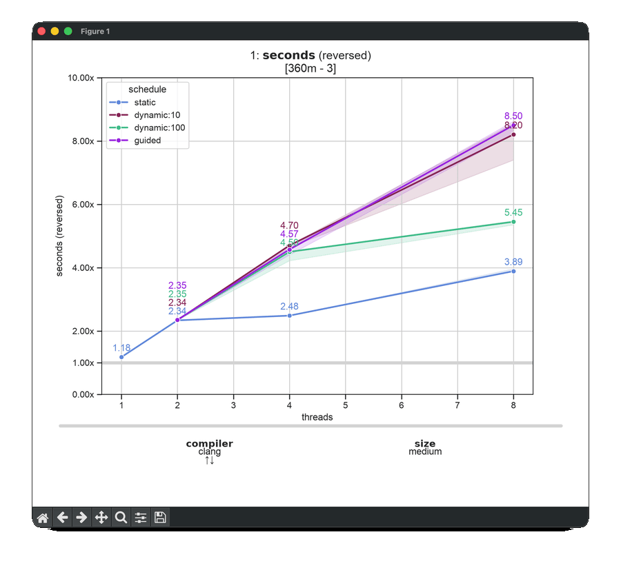
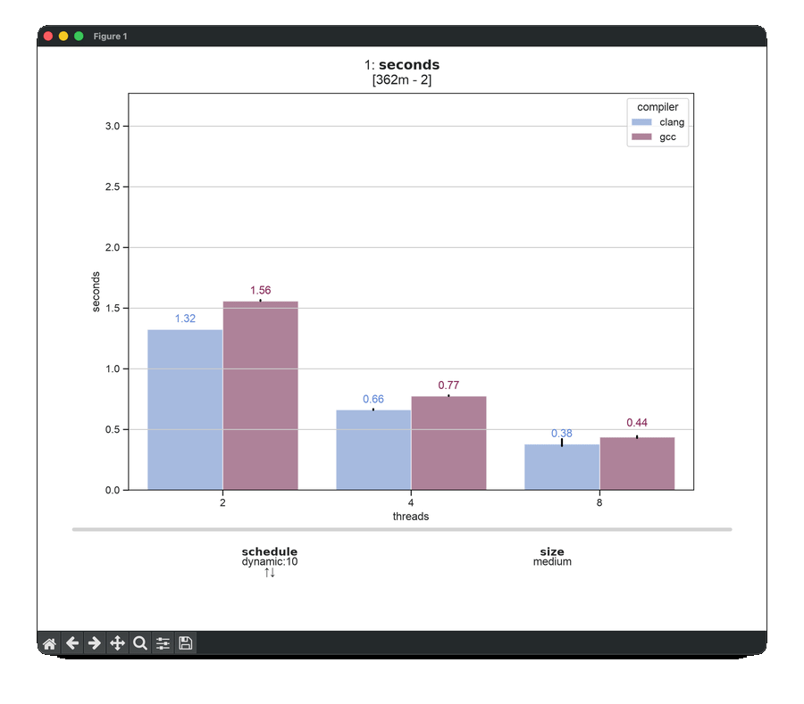

# Parallel Mandelbrot

This example measures strong scaling and load balance while rendering a
Mandelbrot image. It compares GCC and Clang across several image sizes, thread
counts, and OpenMP schedules.

## The Space

The space has four dimensions: `compiler`, `size`, `threads`, and `schedule`.
The non-static schedules only apply when more than one thread is used, so those
combinations are excluded from the space at one thread. That leaves 78 points
rather than the 96 of the full product.

`size` is the side of the square image in pixels — `small` is 600, `medium`
1200, and `large` 2400 — so each step is four times the work of the one before
it. `MAX_ITER` in `yuclid.json` sets the iteration limit, which is what makes
the interior of the set expensive relative to its surroundings.

Each compiler is built once in `setup.point`. The trials then record elapsed
time, throughput in millions of iterations per second, the number of threads
used, and load imbalance. An imbalance of `1.0` means that the work was divided
evenly; larger values mean that the busiest thread ran longer than the average
thread.

The `quick` preset samples the small image at two thread counts and two
schedules. The `scaling` preset keeps the static and guided schedules across
every thread count at the medium image.

```sh
yuclid run
yuclid run --dry-run
yuclid run --preset quick
yuclid run --preset scaling
yuclid run --select compiler=gcc,clang schedule=static
yuclid run --select threads=4,8
yuclid run --select size=small,medium
yuclid run --repeat 3

# At this point, a file like 20260731-120000.yuclid.jsonl is available.

# Compare schedules as the number of threads grows.
yuclid tplot 20260731-120000.yuclid.jsonl -x threads -z schedule -y seconds

# Show how much each schedule gains over static scheduling at each thread count.
yuclid plot 20260731-120000.yuclid.jsonl -x threads -z schedule -y seconds -X schedule=static -r -A

# See whether slower runs correspond to uneven work distribution.
yuclid tplot 20260731-120000.yuclid.jsonl -x threads -z schedule -y imbalance

# Check whether the image size changes which schedule wins.
yuclid plot 20260731-120000.yuclid.jsonl -x size -z schedule -y seconds -L threads=8 -X schedule=static -r -A

# Confirm the work scales with the pixel count and not with anything else.
yuclid plot 20260731-120000.yuclid.jsonl -x size -z threads -y miterations_per_second -L schedule=static
```

The arrow keys move through dimensions that are not on the plot, so one command
is a whole family of plots rather than a single picture. The two animations
below are the ones the README of the project shows, and the command above each
of them is what produced it:

```sh
yuclid plot 20260731-120000.yuclid.jsonl -x threads -z schedule -y seconds -R threads=1 schedule=static compiler=gcc -r -l -A
```



The animation above is strong scaling against GCC at one thread with static
scheduling. Its normalization reference specifies `threads`, `schedule`, and
`compiler`, but deliberately leaves out `size`. The plot therefore uses the
currently selected size as the reference size; that selection is displayed at
the bottom of the plotter and changes as you move between sizes.

```sh
yuclid plot 20260731-120000.yuclid.jsonl -x threads -z compiler -y seconds -A
```



The animation above shows the same measurements without a reference: seconds
as they were measured, the two compilers side by side.

Run `yuclid serve` in another terminal to monitor the space while the
experiment is running.
